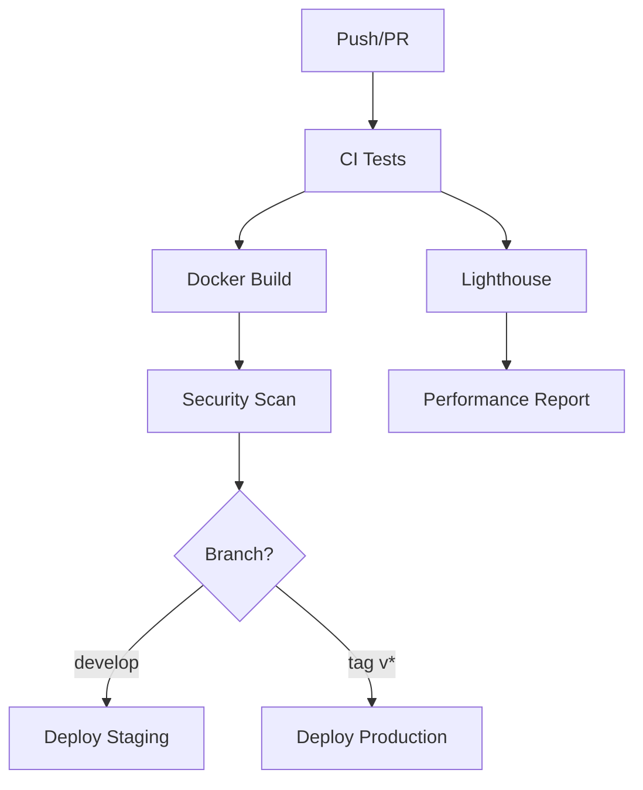

# GitHub Actions CI/CD Guide

This guide explains the GitHub Actions workflows configured for the Rainfall Dashboard project.

## 📋 Overview

The project includes two main workflows:

1. **CI Pipeline** (`ci.yml`) - Testing, linting, and quality checks
2. **Docker Build & Deploy** (`docker-image.yml`) - Container building and deployment

## 🔧 Workflow Files

### 1. CI Pipeline (`.github/workflows/ci.yml`)

This workflow runs on every push and pull request to ensure code quality.

#### **Features:**
- ✅ **Multi-Node Testing**: Tests on Node.js 18.x and 20.x
- ✅ **Dependency Caching**: Fast builds with npm cache
- ✅ **Code Linting**: ESLint checks (optional)
- ✅ **Build Verification**: Ensures the app builds successfully
- ✅ **Lighthouse Performance**: Performance testing on PRs
- ✅ **Artifact Upload**: Saves build artifacts

#### **Triggers:**
- Push to `main`, `master`, or `develop` branches
- Pull requests to `main` or `master`

### 2. Docker Build & Deploy (`.github/workflows/docker-image.yml`)

This workflow builds Docker images and handles deployment.

#### **Features:**
- ✅ **Multi-Platform Builds**: AMD64 and ARM64 support
- ✅ **GitHub Container Registry**: Automatic image publishing
- ✅ **Build Caching**: Faster subsequent builds
- ✅ **Security Scanning**: Trivy vulnerability scanning
- ✅ **Automated Tagging**: Semantic versioning support
- ✅ **Environment Deployments**: Staging and production

#### **Triggers:**
- Push to `main`, `master`, or `develop` branches
- Git tags matching `v*.*.*` pattern
- Pull requests to `main` or `master`

## 🔑 Required Setup

### 1. Repository Settings

#### **Permissions:**
Go to **Settings > Actions > General** and ensure:
- ✅ **Actions permissions**: Allow GitHub Actions
- ✅ **Workflow permissions**: Read and write permissions
- ✅ **Allow GitHub Actions to create and approve pull requests**: Enabled

#### **Environments:**
Create environments in **Settings > Environments**:
- `staging` - For develop branch deployments
- `production` - For tag-based deployments

### 2. Package Registry

The workflow automatically publishes to GitHub Container Registry (`ghcr.io`). No additional setup required.

### 3. Branch Protection (Recommended)

Set up branch protection rules in **Settings > Branches**:

```yaml
# For main/master branch
Required status checks:
  - test (18.x)
  - test (20.x)
  - build
  - security-scan

Require branches to be up to date: ✅
Require linear history: ✅
Include administrators: ✅
```

## 🏷️ Tagging Strategy

The workflow supports semantic versioning:

```bash
# Create and push a tag for production deployment
git tag v1.0.0
git push origin v1.0.0

# This triggers:
# - Docker build with tag v1.0.0
# - Production deployment
# - Security scanning
```

### **Tag Examples:**
- `v1.0.0` → Production deployment
- `v1.1.0` → Minor version update
- `v2.0.0` → Major version update

## 🐳 Docker Images

### **Image Naming:**
```
ghcr.io/username/repository/rainfall-dashboard:latest
ghcr.io/username/repository/rainfall-dashboard:main
ghcr.io/username/repository/rainfall-dashboard:v1.0.0
```

### **Platform Support:**
- `linux/amd64` - Intel/AMD processors
- `linux/arm64` - ARM processors (Apple M1, ARM servers)

### **Build Arguments:**
- `BUILDTIME` - Build timestamp
- `VERSION` - Git version/tag

## 🔍 Security Scanning

### **Trivy Scanner:**
- Scans for vulnerabilities in base images
- Scans for dependency vulnerabilities
- Results uploaded to GitHub Security tab
- Blocks deployment on critical vulnerabilities

### **View Results:**
Go to **Security > Code scanning alerts** to see scan results.

## 📊 Performance Testing

### **Lighthouse CI:**
- Runs on pull requests
- Tests performance, accessibility, SEO
- Uploads results as artifacts
- Configurable thresholds in `.lighthouserc.json`

### **Thresholds:**
- **Performance**: 80%
- **Accessibility**: 90%
- **Best Practices**: 80%
- **SEO**: 80%

## 🚀 Deployment

### **Staging Deployment:**
- Triggered by pushes to `develop` branch
- Uses image tagged with `develop`
- Deploys to staging environment

### **Production Deployment:**
- Triggered by version tags (`v*.*.*`)
- Uses semantically versioned images
- Deploys to production environment

### **Manual Deployment:**
You can also run deployments manually:

```bash
# In GitHub UI: Actions > Docker Build & Deploy > Run workflow
```

## 🛠️ Customization

### **Add Deployment Commands:**

Edit the deployment jobs in `docker-image.yml`:

```yaml
- name: Deploy to staging
  run: |
    echo "Deploying to staging environment..."
    # Add your deployment commands here
    kubectl set image deployment/rainfall-dashboard app=${{ env.REGISTRY }}/${{ env.IMAGE_NAME }}:develop
    # Or use Helm:
    # helm upgrade rainfall-dashboard ./charts/rainfall --set image.tag=develop
    # Or use Docker Compose:
    # docker-compose -f docker-compose.staging.yml up -d
```

### **Add Environment Variables:**

```yaml
# In workflow files
env:
  API_URL: ${{ secrets.API_URL }}
  DATABASE_URL: ${{ secrets.DATABASE_URL }}
```

### **Add Secrets:**
Go to **Settings > Secrets and variables > Actions**:
- `API_URL` - Your API endpoint URL
- `DATABASE_URL` - Database connection string
- `DEPLOY_KEY` - SSH key for deployment

## 🐛 Troubleshooting

### **Common Issues:**

#### 1. **Build Fails on Dependencies**
```yaml
# Add this step before npm ci
- name: Clear npm cache
  run: npm cache clean --force
```

#### 2. **Permission Denied for Package Registry**
- Check **Settings > Actions > General > Workflow permissions**
- Ensure "Read and write permissions" is selected

#### 3. **Docker Build Fails**
```bash
# Check the Dockerfile locally
docker build -t test-image .
docker run -p 3000:80 test-image
```

#### 4. **Lighthouse Fails**
- Check if the app builds correctly
- Verify the serve command works locally
- Check Lighthouse thresholds in `.lighthouserc.json`

### **Debug Workflow:**

Add debug steps to workflows:

```yaml
- name: Debug info
  run: |
    echo "Node version: $(node --version)"
    echo "NPM version: $(npm --version)"
    echo "Current directory: $(pwd)"
    echo "Files: $(ls -la)"
```

## 📈 Monitoring

### **Workflow Status:**
- **Green**: All checks passed
- **Yellow**: Some checks failed but allowed to continue
- **Red**: Critical checks failed

### **Notifications:**
GitHub will send notifications for:
- Failed workflows on main branches
- Security vulnerabilities found
- Failed deployments

### **Badges:**
Add status badges to your README:

```markdown


```

## 🔄 Workflow Dependencies



## 🎯 Best Practices

1. **Always test locally** before pushing
2. **Use semantic versioning** for releases
3. **Keep workflows simple** and focused
4. **Use caching** to speed up builds
5. **Monitor security alerts** regularly
6. **Test deployment scripts** in staging first
7. **Use environment variables** for configuration
8. **Document any custom deployment steps**

Your GitHub Actions workflows are now production-ready and will automatically build, test, and deploy your Rainfall Dashboard! 🚀 